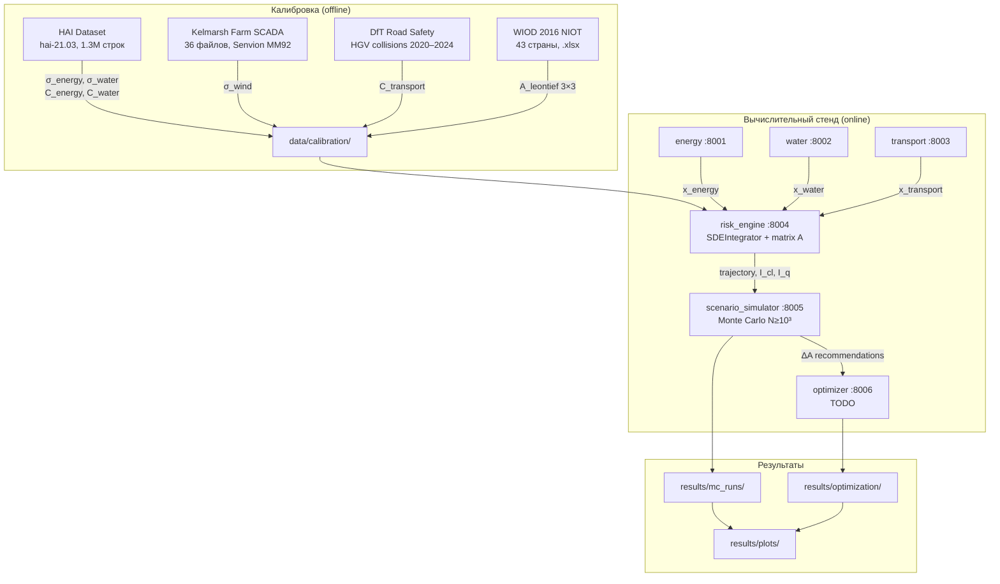

# Архитектура стенда DIPLOMA v2.0 (newresearch)

> Описывает **реально существующее** состояние кода на ветке `newresearch`.  
> Планируемые компоненты помечены `TODO`.  
> Полный реестр изменений: [changes.md](../changes.md)

---

## 1. Таблица сервисов

| Сервис | Порт | Контейнер | Роль | Математика |
|--------|------|-----------|------|-----------|
| energy_service | 8001 | energy_service | Доменная модель энергосектора | risk = clip₀₁((cons/prod − 0.7) / 0.3) |
| water_service | 8002 | water_service | Доменная модель водоснабжения | risk = clip₀₁(max(0, demand − supply) / demand) |
| transport_service | 8003 | transport_service | Доменная модель транспорта | risk = 1 − e^(−k · load) |
| risk_engine | 8004 | risk_engine | СДУ-интегратор, матрица A, cascade detection | Euler–Maruyama, DebtRank (TODO), ICM (TODO) |
| scenario_simulator | 8005 | scenario_simulator | MC-оркестрация сценариев | N ≥ 10³, HTTP-вызовы (переходный период) |
| optimizer | 8006 | optimizer | Стохастическая оптимизация | min_{ΔA} E[Σ w_j(1−S_j)] s.t. budget | **TODO** |
| db | 5433→5432 | diploma-db | PostgreSQL 16 | — |

**Удалены** (относительно предыдущей ветки): ingestor, normalizer, reporting.

---

## 2. API-эндпоинты (реально существующие)

### 2.1. risk_engine (:8004) — `/api/v1/risk/`

| Метод | Путь | Назначение |
|-------|------|-----------|
| GET | `/current` | Текущий агрегированный риск (AggregatedRisk) |
| GET | `/current_iterative` | Риск через итеративный квантитативный оператор |
| POST | `/recalculate` | Пересчитать риск (RiskSnapshotOut) |
| POST | `/update_weights` | Обновить веса секторов |
| GET | `/classical_threshold` | Текущее значение θ |
| POST | `/set_classical_threshold` | Установить θ |
| GET | `/dependency_matrix` | Текущая матрица A (3×3) |
| POST | `/dependency_matrix` | Обновить матрицу A |
| GET | `/history` | История снимков риска |

### 2.2. scenario_simulator (:8005) — `/api/v1/simulator/`

| Метод | Путь | Назначение |
|-------|------|-----------|
| GET | `/catalog` | Каталог сценариев |
| POST | `/run_scenario` | Запустить один сценарий |
| POST | `/monte_carlo` | Monte Carlo (N прогонов) |

### 2.3. energy_service (:8001), water_service (:8002), transport_service (:8003)

Каждый сервис предоставляет стандартный набор эндпоинтов (см. `routers/`):
- GET `/status` — текущее состояние (x_j, risk)
- POST `/update` — обновить параметры (production, consumption, load)
- POST `/outage` — симулировать отказ
- GET `/history` — история состояний

---

## 3. Диаграмма потоков данных



---

## 4. Маппинг: формула → файл → метод

| Формула | Файл | Метод |
|---------|------|-------|
| dx_j = (Σa_{ij}x_i − ρ_j x_j)dt + σ_j x_j dW_j | `services/risk_engine/sde_integrator.py` | `SDEIntegrator.step()` |
| Euler–Maruyama, clip[0,1] | `services/risk_engine/sde_integrator.py` | `SDEIntegrator.run()` |
| I_cl, I_q (каскадные индикаторы) | `services/risk_engine/sde_integrator.py` | `SDEIntegrator.detect_cascade()` |
| a[i][j] = X[i][j] / q[j] | `scripts/calibrate_A.py` | `extract_leontief()` |
| σ = std(Δlog x) / sqrt(dt) | `scripts/calibrate_sigma.py` | `calibrate_hai_sigma()`, `calibrate_kelmarsh_sigma()` |
| C_j = q95(x_j/nominal) | `scripts/calibrate_capacity.py` | `calibrate_threshold()` |
| C_transport = q95(HGV monthly) | `scripts/calibrate_capacity.py` | `calibrate_transport_C_hgv()` |
| Bayesian update (τ_post, μ_post) | `matrix_doc/bayesian_calibrator.py` | `BayesianMatrixCalibrator` |
| DebtRank | `services/risk_engine/baselines.py` | **TODO** |
| ICM | `services/risk_engine/baselines.py` | **TODO** |
| min_{ΔA} E[Σ w_j(1−S_j)] | `services/optimizer/` | **TODO** |

---

## 5. Внешние зависимости

```
/Users/kuprich/Documents/diploma_repo/
├── diploma/                         ← этот репозиторий (ветка newresearch)
└── datasets/                        ← внешние данные (не в git)
    ├── dataset hai /hai/            ← HAI ICS Security Dataset (hai-21.03)
    ├── kelmarsh/                    ← Kelmarsh Farm SCADA (Zenodo 5841834)
    ├── Road safety open data/       ← DfT Road Safety (UK, 2020–2024)
    ├── OpenWindSCADA/               ← meta-repo (ссылки; данные из Kelmarsh)
    └── (wiod/)                      ← WIOD 2016 NIOT внутри репо: matrix_doc/sources/NIOTS/
```

Конфигурация путей: `config.env` (не в git) / `config.env.example` (шаблон).

---

## 6. Что удалено

Полный реестр: [changes.md](../changes.md). Краткая сводка:

- **Удалены сервисы**: ingestor, normalizer, reporting — skeleton-сервисы без расчётных функций
- **Удалена документация**: docs/00–06_*.md, docs/STAND_ARCHITECTURE.md, docs/c4/, docs/regression/
- **Удалены артефакты**: results/*.json (старые MC), results/theta_sweep/, Baltimore 2024/, UCTE 2007 /
- **Удалены скрипты**: все HTTP-MC скрипты (run_theta_sweep.py, run_load_sweep.py и др.)
- **Удалены директории**: real_scenarios_testbed/, real_data_validation/, validation/, experiments/, test/
