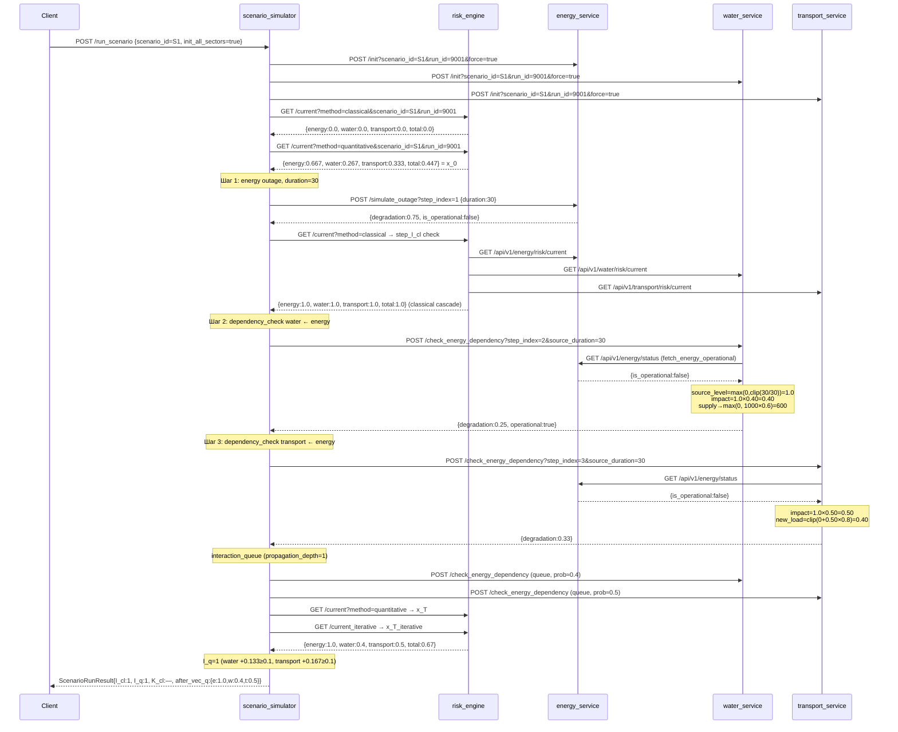
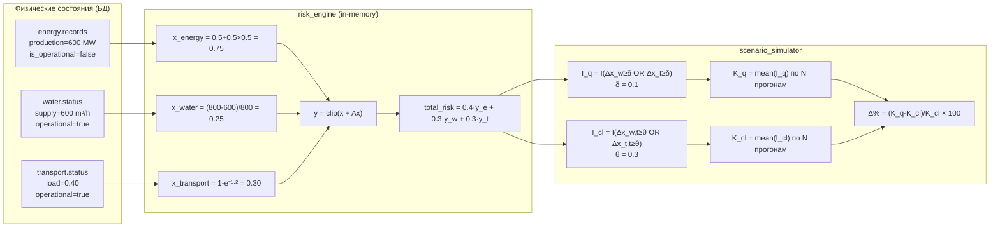
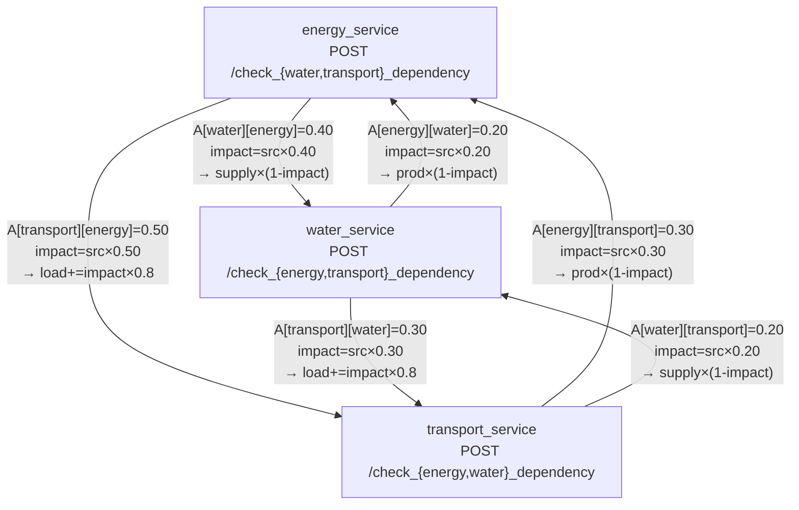

# Архитектура вычислительного стенда infrastructure-risk

> **Источник**: аудит кодовой базы от 2026-04-01.
> Все числовые значения взяты из кода, а не из документации.
> Расхождения с `ARCHITECTURE.md` помечены меткой **⚠ drift**.

---

## Содержание

1. [Инвентарь сервисов](#1-инвентарь-сервисов)
2. [Доменные сервисы](#2-доменные-сервисы)
   - 2.1 [energy_service](#21-energy_service)
   - 2.2 [water_service](#22-water_service)
   - 2.3 [transport_service](#23-transport_service)
3. [Risk Engine](#3-risk-engine)
4. [Scenario Simulator](#4-scenario-simulator)
5. [Вспомогательные сервисы](#5-вспомогательные-сервисы)
6. [Слой данных](#6-слой-данных)
7. [Карта межсервисных вызовов](#7-карта-межсервисных-вызовов)
8. [Mermaid-диаграммы](#8-mermaid-диаграммы)

---

## 1. Инвентарь сервисов

| Сервис | Контейнер:порт | Внешний порт | Схема БД | Описание |
|---|---|---|---|---|
| energy_service | `energy_service:8000` | **8001** | `energy` | Физика энергосектора |
| water_service | `water_service:8000` | **8002** | `water` | Физика водоснабжения |
| transport_service | `transport_service:8000` | **8003** | `transport` | Физика транспорта |
| risk_engine | `risk_engine:8000` | **8004** | `risk` | Агрегация рисков, матрица A |
| scenario_simulator | `scenario_simulator:8000` | **8005** | — | Оркестрация экспериментов, MC |
| reporting | `reporting:8000` | **8010** | `reporting` | Снапшоты, история, реестр экспериментов |
| ingestor | `ingestor:8000` | не проброшен | `ingestor` | Приём сырых событий |
| normalizer | `normalizer:8000` | не проброшен | `normalized` | Нормализация событий (skeleton) |
| db | `db:5432` | **5433** | `diploma` | PostgreSQL 16 |

**Общая БД:** `postgresql://postgres:postgres@db:5432/diploma`.
Каждый сервис использует **отдельную схему** для изоляции данных.
`services/*/database.py` — schema management per service.

**RabbitMQ:** контейнер `diploma-rabbitmq` присутствует как orphan в текущем compose (не объявлен в `docker-compose.yml`). Код не содержит consumer/producer реализаций — **очередей нет**. Исторические ссылки в комментариях.

---

## 2. Доменные сервисы

### 2.1 energy_service

**Файлы:** `services/energy_service/{config.py, models.py, schemas.py, routers/energy.py}`

#### Конфигурация (`config.py`)

| Параметр | Значение по умолчанию | docker-compose override |
|---|---|---|
| `DATABASE_URL` | `postgresql://postgres:postgres@db:5432/diploma` | — |
| `WATER_SERVICE_URL` | `http://water_service:8000` | — |
| `TRANSPORT_SERVICE_URL` | `http://transport_service:8000` | — |
| `DEPENDENCY_CHECK_TIMEOUT` | `5.0` | — |
| `DEFAULT_PRODUCTION` | `1000.0` (MW) | — |
| `DEFAULT_CONSUMPTION` | `900.0` (MW) | — |
| `MAX_OUTAGE_DURATION` | `60` (мин) | — |
| `OUTAGE_BASE_RISK` | `0.5` | — |
| `OUTAGE_DURATION_WEIGHT` | `0.5` | — |
| `UTILIZATION_LOW` | `0.7` | — |
| `UTILIZATION_HIGH` | `1.0` | — |

#### Таблица БД: `energy.records`

| Колонка | Тип | Описание |
|---|---|---|
| `id` | INTEGER PK | — |
| `scenario_id` | STRING(128) | Ключ изоляции эксперимента |
| `run_id` | INTEGER | Номер прогона MC |
| `step_index` | INTEGER | Индекс шага сценария |
| `action` | STRING(64) | Имя действия (init, outage, …) |
| `production` | FLOAT | Производство (МВт) |
| `consumption` | FLOAT | Потребление (МВт) |
| `is_operational` | BOOLEAN | Флаг работоспособности |
| `reason` | STRING(255) | Причина аварии |
| `duration` | INTEGER | Длительность аварии (мин) |
| `created_at` | DATETIME | — |

#### Формула доменного риска

**`routers/energy.py:compute_energy_risk(record)`**

Базовое состояние t=0:
- production = 1000.0, consumption = 900.0, is_operational = true
- utilization = 0.9 → `util_term = (0.9 − 0.7) / 0.3 = 0.667`
- **x_energy(0) = 0.667**

Рабочий режим (`is_operational = True`):
```
utilization = consumption / production
util_term   = (utilization − UTILIZATION_LOW) / max(1e-9, UTILIZATION_HIGH − UTILIZATION_LOW)
            = (utilization − 0.7) / 0.3
x_energy    = clip01(util_term)
```
Специальный случай: если `production ≤ 0`, возвращает `0.95`.

Режим аварии (`is_operational = False`, `routers/energy.py:284–290`):
```
duration_factor     = clip01(duration / 60)
degraded_production = max(0.0, production × (1 − 0.85 × duration_factor))
is_operational      = (duration_factor < 0.98)

x_energy = clip01(0.5 + 0.5 × duration_factor)
```
Пример: duration=30 → duration_factor=0.5 → x_energy = clip01(0.5 + 0.25) = **0.75**

#### Действия (эндпоинты)

Префикс: `/api/v1/energy`

| Метод | Путь | Тело / query | Что делает |
|---|---|---|---|
| GET | `/status` | `scenario_id`, `run_id` | Возвращает `EnergyStatus` (production, consumption, is_operational, degradation) |
| GET | `/risk/current` | `scenario_id`, `run_id` | Вычисляет и возвращает `EnergyRisk` |
| POST | `/init` | `scenario_id`, `run_id`, `force` | Сбрасывает в baseline (prod=1000, cons=900, is_operational=true) |
| POST | `/simulate_outage` | query: `scenario_id,run_id,step_index,action`; body: `{reason, duration}` | Применяет `degraded_production = prod × (1 − 0.85 × duration/60)` |
| POST | `/resolve_outage` | query | Восстанавливает baseline, is_operational=true |
| POST | `/increase_load` | `amount` (query) | `new_production = max(1.0, production − amount × DEFAULT_PRODUCTION)` |
| POST | `/adjust_production` | `amount` | Устанавливает production напрямую |
| POST | `/adjust_consumption` | `amount` | Устанавливает consumption напрямую |
| POST | `/check_water_dependency` | `source_duration`, `source_degradation` | A[energy][water] = **0.2** |
| POST | `/check_transport_dependency` | `source_duration`, `source_degradation` | A[energy][transport] = **0.3** |

#### Формулы dependency_check (`routers/energy.py:430–552`)

```
# Общая формула для check_*_dependency:
is_source_ok = await fetch_*_operational(scenario_id, run_id)
if not is_source_ok:
    source_level        = max(source_degradation, clip01(source_duration / 30.0))
    impact              = clip01(source_level × dependency_weight)
    degraded_production = max(0.0, production × (1 − impact))
    # Сохраняется новая запись; is_operational сохраняется из оригинала
```

| Вызов | `dependency_weight` | источник |
|---|---|---|
| `check_water_dependency` | **0.2** | `routers/energy.py:434` |
| `check_transport_dependency` | **0.3** | `routers/energy.py:507` |

#### Исходящие HTTP-вызовы

```
fetch_water_operational()     → GET {WATER_SERVICE_URL}/api/v1/water/status
fetch_transport_operational() → GET {TRANSPORT_SERVICE_URL}/api/v1/transport/status
```
На ошибку (любой HTTPError): `return False`
`WATER_SERVICE_URL` default=`http://water_service:8000` (нет path-prefix — корректно).

---

### 2.2 water_service

**Файлы:** `services/water_service/{config.py, models.py, schemas.py, routers/water.py}`

#### Конфигурация (`config.py`)

| Параметр | Значение по умолчанию | docker-compose override |
|---|---|---|
| `ENERGY_SERVICE_URL` | `http://energy_service:8000` | `http://energy_service:8000/api/v1/energy` |
| `TRANSPORT_SERVICE_URL` | `http://transport_service:8000` | — |
| `ENERGY_CHECK_TIMEOUT` | `5.0` | — |
| `DEFAULT_SUPPLY` | `1000.0` (м³/ч) | — |
| `DEFAULT_DEMAND` | `800.0` (м³/ч) | — |

#### Таблица БД: `water.status`

| Колонка | Тип | Описание |
|---|---|---|
| `id` | INTEGER PK | — |
| `scenario_id` | STRING(100) | — |
| `run_id` | INTEGER | — |
| `supply` | FLOAT | Подача воды (м³/ч) |
| `demand` | FLOAT | Спрос (м³/ч) |
| `operational` | BOOLEAN | Флаг работоспособности |
| `energy_dependent` | BOOLEAN | Зависимость от энергии |
| `reason` | STRING(255) | — |

#### Формула доменного риска

**`routers/water.py:compute_water_degradation(record)`**

Базовое состояние t=0:
- supply = 1000.0, demand = 800.0, operational = true
- deficit = max(0, 800 − 1000) = 0 → **x_water(0) = 0.0**

```
if not operational:
    x_water = 1.0
elif supply <= 0:
    x_water = 1.0
else:
    deficit  = max(0.0, demand − supply)
    x_water  = clip01(deficit / max(demand, 1.0))
```

#### Действия

Префикс: `/api/v1/water`

| Метод | Путь | Что делает |
|---|---|---|
| POST | `/init` | Сброс: supply=1000, demand=800, operational=true |
| GET | `/status` | `WaterStatus` (supply, demand, operational, degradation) |
| GET | `/risk/current` | `WaterRisk` |
| POST | `/increase_load` | `reduction = amount × 1000.0`; `new_supply = max(0.0, supply − reduction)` |
| POST | `/adjust_supply` | Прямое обновление supply |
| POST | `/adjust_demand` | Прямое обновление demand |
| POST | `/resolve_outage` | Восстанавливает baseline |
| POST | `/check_energy_dependency` | A[water][energy] = **0.40** |
| POST | `/check_transport_dependency` | A[water][transport] = **0.2** |

#### Формулы dependency_check (`routers/water.py:349–432`)

```
# check_energy_dependency:
is_energy_ok = await fetch_energy_operational(scenario_id, run_id)
if not is_energy_ok:
    source_level   = max(source_degradation, clip01(source_duration / 30.0))
    impact         = clip01(source_level × 0.40)      # A[water][energy] = 0.40
    reduced_supply = max(0.0, supply × (1 − impact))
    operational    = (impact < 0.95)
```

| Вызов | `dependency_weight` | источник |
|---|---|---|
| `check_energy_dependency` | **0.40** | `routers/water.py:359` |
| `check_transport_dependency` | **0.2** | `routers/water.py:431` |

> **⚠ drift**: в ARCHITECTURE.md упоминается domain weight 0.55. Исправлено на 0.40 (выравнивание с матрицей A) в коммите 2026-03-29.

#### Исходящие HTTP-вызовы

```
fetch_energy_operational()    → GET {ENERGY_SERVICE_URL}/status
fetch_transport_operational() → GET {TRANSPORT_SERVICE_URL}/status
```

`ENERGY_SERVICE_URL` в docker-compose: `http://energy_service:8000/api/v1/energy`
→ итоговый URL: `http://energy_service:8000/api/v1/energy/status` ✓ (исправлен 2026-03-29)

На 404: `return True` (нет записи = ещё не деградирован).
На любую другую ошибку: `return True`.

---

### 2.3 transport_service

**Файлы:** `services/transport_service/{config.py, models.py, schemas.py, routers/transport.py}`

#### Конфигурация (`config.py`)

| Параметр | Значение по умолчанию | docker-compose override |
|---|---|---|
| `ENERGY_SERVICE_URL` | `http://energy_service:8000` | `http://energy_service:8000/api/v1/energy` |
| `WATER_SERVICE_URL` | `http://water_service:8000` | `http://water_service:8000/api/v1/water` |
| `ENERGY_CHECK_TIMEOUT` | `5.0` | — |
| `DEFAULT_LOAD` | `0.0` | — |

#### Таблица БД: `transport.status`

| Колонка | Тип | Описание |
|---|---|---|
| `id` | INTEGER PK | — |
| `scenario_id` | STRING(100) | — |
| `run_id` | INTEGER | — |
| `load` | FLOAT | Нагрузка сети [0, +∞) |
| `operational` | BOOLEAN | Флаг работоспособности |
| `energy_dependent` | BOOLEAN | — |
| `reason` | STRING(255) | — |

#### Формула доменного риска

**`routers/transport.py:compute_transport_degradation(record)`**

Базовое состояние t=0:
- load = 0.0, operational = true
- **x_transport(0) = 1 − e⁻⁰ = 0.0**

Рабочий режим:
```
load_term    = 1.0 − exp(−3.0 × max(0.0, load))
x_transport  = clip01(load_term)
```

Нерабочий режим (`operational = False`):
```
x_transport = clip01(max(0.85, load_term))
```
Мягкий пол 0.85 предотвращает бинарные скачки.

#### Действия

Префикс: `/api/v1/transport`

| Метод | Путь | Что делает |
|---|---|---|
| POST | `/init` | Сброс: load=0.0, operational=true |
| GET | `/status` | `TransportStatus` (load, operational, degradation) |
| GET | `/risk/current` | `TransportRisk` |
| POST | `/increase_load` | `new_load = max(0.0, load + amount)` |
| POST | `/update_load` | Устанавливает load напрямую (принимает JSON body `{"load": float}`) |
| POST | `/resolve_outage` | Восстанавливает baseline |
| POST | `/check_energy_dependency` | A[transport][energy] = **0.50** |
| POST | `/check_water_dependency` | A[transport][water] = **0.3** |

#### Формулы dependency_check (`routers/transport.py:284–392`)

```
# check_energy_dependency:
is_energy_ok = await fetch_energy_operational(scenario_id, run_id)
if not is_energy_ok:
    source_level = max(source_degradation, clip01(source_duration / 30.0))
    impact       = clip01(source_level × 0.50)        # A[transport][energy] = 0.50
    new_load     = clip01(load + impact × 0.8)
    # operational остаётся True (мягкое воздействие)
```

| Вызов | `dependency_weight` | источник |
|---|---|---|
| `check_energy_dependency` | **0.50** | `routers/transport.py:313` |
| `check_water_dependency` | **0.3** | `routers/transport.py:385` |

> **⚠ drift**: в ARCHITECTURE.md упоминается domain weight 0.70. Исправлено на 0.50 (выравнивание с матрицей A) в коммите 2026-03-29.

#### Исходящие HTTP-вызовы

```
fetch_energy_operational() → GET {ENERGY_SERVICE_URL}/status
fetch_water_operational()  → GET {WATER_SERVICE_URL}/status
```

`ENERGY_SERVICE_URL` в docker-compose: `http://energy_service:8000/api/v1/energy`
→ итоговый URL: `http://energy_service:8000/api/v1/energy/status` ✓ (исправлен 2026-03-29)

На ошибку: `return True`.

---

## 3. Risk Engine

**Файлы:** `services/risk_engine/{config.py, models.py, schemas.py, routers/risk.py}`

### Конфигурация (`config.py`)

| Параметр | Значение | docker-compose override |
|---|---|---|
| `ENERGY_SERVICE_URL` | `http://energy_service:8000/api/v1/energy/status` | то же |
| `WATER_SERVICE_URL` | `http://water_service:8000/api/v1/water/status` | то же |
| `TRANSPORT_SERVICE_URL` | `http://transport_service:8000/api/v1/transport/status` | то же |
| `ENERGY_WEIGHT` | **0.4** | — |
| `WATER_WEIGHT` | **0.3** | — |
| `TRANSPORT_WEIGHT` | **0.3** | — |
| `THETA_BIN` | **0.70** | `THETA_BIN` env var |
| `DEPENDENCY_MATRIX_VERSION` | `"v1.0"` | — |
| `ENABLE_DYNAMIC_MATRIX` | `True` | — |
| `ENABLE_DYNAMIC_WEIGHTS` | `True` | — |
| `REQUEST_TIMEOUT` | `5.0` | — |

> **Примечание по весам**: в `routers/risk.py:31–35` используется `getattr(settings, "ENERGY_WEIGHT", 0.7)` с fallback 0.7. Поскольку `config.py` явно определяет `ENERGY_WEIGHT=0.4`, fallback никогда не применяется — фактические веса: **0.4 / 0.3 / 0.3**.

### Матрица зависимостей A v1.0 (`config.py:47–51`)

```
       Источник воздействия (j)
       energy  water  transport
A[i][j]:
energy   0.0    0.2    0.3      ← energy ← water (0.2), ← transport (0.3)
water    0.4    0.0    0.2      ← water  ← energy (0.4), ← transport (0.2)
transport 0.5   0.3    0.0      ← transport ← energy (0.5), ← water (0.3)
```
Семантика: `A[i][j]` — вклад сектора j в риск сектора i.

Матрица живёт в памяти как `CURRENT_DEPENDENCY_MATRIX` (`routers/risk.py:46–51`).
Версия: `CURRENT_DEPENDENCY_MATRIX_VERSION = "v1.0"`.
Может быть обновлена через `POST /api/v1/risk/dependency_matrix` при `ENABLE_DYNAMIC_MATRIX=True`.

### Таблица БД: `risk.risk_snapshots`

| Колонка | Тип | Описание |
|---|---|---|
| `id` | INTEGER PK | — |
| `calculated_at` | DATETIME | Метка расчёта |
| `energy_risk` | FLOAT | — |
| `water_risk` | FLOAT | — |
| `transport_risk` | FLOAT | — |
| `total_risk` | FLOAT | — |
| `meta` | JSON | weights, method, matrix version, raw sector risks |

### Алгоритмы расчёта

#### Сбор данных (`routers/risk.py:231–293`)

`fetch_sector_risk(url, name, scenario_id, run_id)` с приоритетами:

1. Пробует `/risk/current` endpoint → поле `"risk"` → возвращает float
2. Fallback: `/status` endpoint:
   - Есть поле `"degradation"` → берёт его
   - Иначе из `supply`/`demand` → `deficit / demand`
   - Иначе из `"load"` → берёт его
   - Иначе бинарно: `is_operational → 0.0 / 1.0`
3. На любую ошибку: **возвращает 1.0** (максимальный риск)

Все три сектора опрашиваются параллельно через `asyncio.gather`.

#### Количественный оператор (`routers/risk.py:89–117`)

```python
# x = [x_energy, x_water, x_transport]
y[i] = x[i] + Σⱼ A[i][j] × x[j]     # i = 0,1,2
y[i] = clip01(y[i])
```

Расписано покомпонентно:
```
y_energy    = clip01(x_energy    + 0.2·x_water + 0.3·x_transport)
y_water     = clip01(x_water     + 0.4·x_energy + 0.2·x_transport)
y_transport = clip01(x_transport + 0.5·x_energy + 0.3·x_water)
```

#### Итерационный количественный оператор (`routers/risk.py:120–161`)

```python
x(t+1)[i] = clip01(x(t)[i] + Σⱼ A[i][j] × x(t)[j])
# Итерация до сходимости:
if max_i |x(t+1)[i] − x(t)[i]| < epsilon:
    break
```
- `max_steps = 20`, `epsilon = 0.001`
- Возвращает `convergence_steps` (фактически: 3–4 шага по данным Sprint 2)

#### Классический оператор (`routers/risk.py:164–210`)

**Два механизма, разделены намеренно:**

Фаза 1 — бинаризация узла:
```
y[i] = 1.0   если x[i] >= CURRENT_THETA_BIN (0.70)
y[i] = 0.0   иначе
```

Обоснование выбора 0.70: максимальный базовый риск x_energy(0) = 0.667 < 0.70, поэтому до удара y = {0,0,0}.

Фаза 2 — каскадное распространение по топологии:
```
y_next[i] = 1.0   если y[i]=1 ИЛИ ∃j: y[j]=1 И A[i][j] > 0.0
```
Критерий активации ребра: `A[i][j] > 0.0` (структурная топология, не пороговая).

Возвращает бинарные риски ∈ {0.0, 1.0}.

#### Интегральный риск

```
total_risk = (adj_energy × 0.4 + adj_water × 0.3 + adj_transport × 0.3) / 1.0
total_risk = clip01(total_risk)
```

### API эндпоинты

Префикс: `/api/v1/risk`

| Метод | Путь | Параметры | Возвращает |
|---|---|---|---|
| GET | `/current` | `method`, `scenario_id`, `run_id` | `AggregatedRisk` (не сохраняет в БД) |
| GET | `/current_iterative` | `scenario_id`, `run_id`, `max_steps`, `epsilon` | Риски + `convergence_steps`, `trajectory` |
| POST | `/recalculate` | body: `{save, method, scenario_id, run_id}` | `AggregatedRisk` или `RiskSnapshotOut` |
| POST | `/update_weights` | body: `{energy, water, transport}` | JSON |
| GET | `/classical_threshold` | — | `{theta_bin, theta_bin_default, …}` |
| POST | `/set_classical_threshold` | body: `{theta_bin}` | JSON |
| GET | `/dependency_matrix` | — | `{matrix, version, sectors_order}` |
| POST | `/dependency_matrix` | body: `{matrix}` | JSON |
| GET | `/history` | `limit` | Список `RiskSnapshotOut` |

---

## 4. Scenario Simulator

**Файлы:** `services/scenario_simulator/{config.py, schemas.py, routers/simulator.py}`

### Конфигурация (`config.py`)

| Параметр | docker-compose value |
|---|---|
| `RISK_ENGINE_URL` | `http://risk_engine:8000` |
| `ENERGY_SERVICE_URL` | `http://energy_service:8000` |
| `WATER_SERVICE_URL` | `http://water_service:8000` |
| `TRANSPORT_SERVICE_URL` | `http://transport_service:8000` |
| `REPORTING_SERVICE_URL` | `http://reporting:8000/api/v1/reporting` |
| `DEFAULT_OUTAGE_DURATION` | `10` |
| `SIMULATION_RUNS` | `20` |

### Каталог сценариев (`SCENARIO_CATALOG`, `routers/simulator.py:37–109`)

| ID | Инициатор | Действие | Параметры |
|---|---|---|---|
| `S1_energy_outage` | energy | outage(30) + dep_check water + dep_check transport | duration=30 |
| `S2_water_outage` | water | outage(30) | duration=30 |
| `S3_transport_load` | transport | load_increase | amount=0.25 |
| `S1b_energy_partial` | energy | load_increase | amount=0.01 |
| `S4_water_partial` | water | load_increase | amount=0.70 |
| `REAL_texas_2021` | energy | outage(30) + dep_check×2 | Texas 2021 |
| `REAL_india_2012` | energy | outage(25) + dep_check×2 | India 2012 |
| `REAL_europe_2006` | energy | outage(10) + dep_check×2 | Europe 2006 |
| `REAL_baltimore_2024` | transport | load_increase(0.30) + dep_check×2 | Baltimore 2024 |
| `REAL_christchurch_2011` | energy | outage(25) + water load_increase(0.70) + transport load_increase(0.40) | Christchurch 2011 |

### API эндпоинты

Префикс: `/api/v1/simulator`

| Метод | Путь | Тело | Возвращает |
|---|---|---|---|
| GET | `/catalog` | — | `ScenarioCatalog` (список с шагами) |
| POST | `/run_scenario` | `ScenarioRequest` | `ScenarioRunResult` |
| POST | `/monte_carlo` | `MonteCarloRequest` | `MonteCarloResult` |

### Логика `run_scenario` (`routers/simulator.py:649–910`)

```
1. Разрешить шаги: из SCENARIO_CATALOG[scenario_id] или из req.steps
2. Сортировать шаги по step_index
3. Вычислить seed = SHA256(scenario_id:run_id)[:16]
4. Применить exogenous_factor = weather × load × fuel_stress к параметрам шагов
5. Стохастическая рандомизация:
   - outage.duration  → round(duration × (1 + gauss(0, stochastic_scale) + sector_het))
   - load_increase.amount → amount × (1 + gauss(0, stochastic_scale) + sector_het)
6. Определить initiator = steps[0].sector
7. Инициализировать доменные сервисы (POST /init × 3)
8. Считать x_0 через fetch_risk(method="classical") и fetch_risk(method="quantitative")
9. Для каждого шага:
   a. _apply_step(step)  → POST к доменному сервису
   b. fetch_risk(method="classical") → вычислить step_I_cl
   c. Если action ∈ {outage, dependency_check, load_increase}:
      _run_interaction_queue() → дополнительные dependency_check по ненулевым рёбрам A
10. Считать x_T (final) для quantitative + classical + iterative
11. Вычислить I_cl, I_q, I_qi
12. (Опц.) Recovery trajectory
13. Вернуть ScenarioRunResult
```

#### Каскадная очередь `_run_interaction_queue` (`routers/simulator.py:272–397`)

```
Алгоритм BFS по матрице A:
- Начальная очередь: [{source_sector, depth=0, …}]
- Для каждого source_sector:
  - Найти все dest, где A[dest][source] > 0.0
  - Для каждого dest:
    probability = clip(A[dest][source] × U(0.9, 1.1), 0.05, 0.95)
    if random() <= probability:
      _apply_step(dependency_check, dest, source_sector, ...)
      if depth < max_depth:
        queue.append({source=dest, depth+1, ...})
- Стоп: max_depth (по умолчанию 1, max 4), max_messages=32
```

Вес ребра определяет вероятность срабатывания, а не бинарный порог.

#### Индикаторы каскада

```
I_cl(s, r) = 1   если ∃ t, ∃ i ≠ i₀: Δx_cl_i(t) ≥ θ_cascade
             0   иначе
# θ_cascade из ScenarioRequest.theta_classical (default 0.3)

I_q(s, r)  = 1   если ∃ i ≠ i₀: Δx_q_i(T) ≥ δ
             0   иначе
# δ = delta_sector_threshold = 0.1 (hardcoded в routers/simulator.py:803)

I_qi(s, r) = 1   если ∃ i ≠ i₀: Δx_qi_i(T) ≥ δ
```

### Логика `run_monte_carlo` (`routers/simulator.py:1185–1412`)

```
Валидация: runs >= 100, duration_max >= duration_min

Для r = 1..N:
  run_id = start_run_id + (r − 1)
  seed   = derive_seed(scenario_id, run_id, base_seed)
  duration = rng.randint(duration_min, duration_max)

  dependency_multiplier = max(0.0, 1 + gauss(0, stochastic_scale))
  exogenous_factor = weather_factor × load_factor × fuel_stress_factor

  steps = _build_mc_steps(req, duration, dependency_multiplier, exogenous_factor)
  result = await run_scenario(ScenarioRequest(steps=steps, init_all_sectors=True, ...))

  Собрать: I_cl, I_q, delta_R

Агрегация:
  K_cl = mean(I_cl_r)  для r = 1..N
  K_q  = mean(I_q_r)
  K_qi = mean(I_qi_r)
  Δ%   = (K_q − K_cl) / max(K_cl, 1e-9) × 100
  mean_delta, p95_delta, std_delta, duration_correlation
```

Для MC с `initiator_action="outage"` и `sector="energy"` `_build_mc_steps` строит 3 шага:
`outage(energy) + dep_check(water) + dep_check(transport)`.

**После завершения MC**: сохраняет сводку в reporting service через `POST /experiments/register` (best-effort, ошибки не прерывают MC).

---

## 5. Вспомогательные сервисы

### reporting

**Файлы:** `services/reporting/{config.py, models.py, schemas.py, routers/reporting.py}`

Подключается к: energy (status), water (status), transport (status), risk_engine (current), normalizer, scenario_simulator.

**Схема БД:** `reporting.*`

| Таблица | Ключевые поля |
|---|---|
| `sector_status_snapshots` | snapshot_at, experiment_id, scenario_id, run_id, sectors (JSON) |
| `risk_overview_snapshots` | snapshot_at, experiment_id, method, energy_risk, water_risk, transport_risk, total_risk |
| `experiments` | scenario_id, method, n_runs, delta_threshold, matrix_A_version, git_commit, started_at, finished_at, params (JSON) |
| `experiment_runs` | experiment_id, run_id, I_cl, I_q, delta_R, seed |
| `experiment_results` | experiment_id, K_cl, K_q, Delta_percent, p_value, ci_low, ci_high, distributions (JSON) |

**API:** `GET /api/v1/reporting/summary`, `GET /risk/history`, `GET /snapshots/sectors`, `GET /snapshots/risk`
**Приём от simulator:** `POST /experiments/register` (не является GET-only сервисом).

### ingestor

Минимальный сервис для приёма внешних событий.
`POST /api/v1/ingestor/ingest` → сохраняет `RawEvent{source, payload}` в `ingestor.raw_events`.
`GET /api/v1/ingestor/ping` → healthcheck.
Нет исходящих HTTP-вызовов.

### normalizer

Периодически забирает из ingestor и нормализует.
`BATCH_SIZE=100`, `RUN_INTERVAL_SEC=10`, `SKIP_IF_EMPTY=true`.
`POST /api/v1/normalizer/run` → запускает батч-нормализацию (логика — skeleton, возвращает 0 processed).
`GET /api/v1/normalizer/status`, `GET /api/v1/normalizer/events`.
Исходящий вызов: `GET {INGESTOR_URL}/events` для получения raw_events.

---

## 6. Слой данных

### PostgreSQL

Единая БД `diploma` с разделением по схемам:

```
diploma/
├── energy.records          ← energy_service (физические параметры)
├── water.status            ← water_service
├── transport.status        ← transport_service
├── risk.risk_snapshots     ← risk_engine (после POST /recalculate)
├── reporting.sector_status_snapshots
├── reporting.risk_overview_snapshots
├── reporting.experiments
├── reporting.experiment_runs
├── reporting.experiment_results
├── ingestor.raw_events
└── normalized.normalized_events
```

**scenario_simulator не имеет таблиц** — все состояния хранятся в доменных сервисах.

Порт PostgreSQL: `db:5432` (внутри Docker), `localhost:5433` (снаружи).

### State isolation pattern

Все записи в доменных сервисах привязаны к `(scenario_id, run_id)`.
При `init_all_sectors=True` симулятор вызывает `POST /init?force=true` на всех трёх сервисах, создавая чистый baseline для каждого прогона.
`latest_status(db, scenario_id, run_id)` — всегда берётся последняя запись по `ORDER BY id DESC LIMIT 1`.

### RabbitMQ

Контейнер `diploma-rabbitmq` присутствует как Docker orphan (нет в `docker-compose.yml`).
**Ни один сервис не подключается к RabbitMQ** — нет `aio-pika`, `pika`, `kombu` зависимостей в requirements.txt.
Каскадное распространение реализовано синхронно через `_run_interaction_queue` (HTTP).

---

## 7. Карта межсервисных вызовов

### Полная таблица

| Источник | Назначение | Endpoint | Метод | Контекст | Матричный вес |
|---|---|---|---|---|---|
| energy_service | water_service | `/api/v1/water/status` | GET | `check_water_dependency` | — |
| energy_service | transport_service | `/api/v1/transport/status` | GET | `check_transport_dependency` | — |
| water_service | energy_service | `{ENERGY_SERVICE_URL}/status` → `/api/v1/energy/status` | GET | `check_energy_dependency` | A[water][energy]=0.4 |
| water_service | transport_service | `{TRANSPORT_SERVICE_URL}/status` | GET | `check_transport_dependency` | A[water][transport]=0.2 |
| transport_service | energy_service | `{ENERGY_SERVICE_URL}/status` → `/api/v1/energy/status` | GET | `check_energy_dependency` | A[transport][energy]=0.5 |
| transport_service | water_service | `{WATER_SERVICE_URL}/status` | GET | `check_water_dependency` | A[transport][water]=0.3 |
| risk_engine | energy_service | `/api/v1/energy/risk/current` → fallback `/status` | GET | `fetch_sector_risk` | — |
| risk_engine | water_service | `/api/v1/water/risk/current` → fallback `/status` | GET | `fetch_sector_risk` | — |
| risk_engine | transport_service | `/api/v1/transport/risk/current` → fallback `/status` | GET | `fetch_sector_risk` | — |
| scenario_simulator | risk_engine | `/api/v1/risk/current` | GET | после каждого шага, до и после сценария | — |
| scenario_simulator | risk_engine | `/api/v1/risk/current_iterative` | GET | финальный x_T | — |
| scenario_simulator | risk_engine | `/api/v1/risk/classical_threshold` | GET | theta save/restore | — |
| scenario_simulator | risk_engine | `/api/v1/risk/set_classical_threshold` | POST | theta override | — |
| scenario_simulator | risk_engine | `/api/v1/risk/dependency_matrix` | GET | fetch A meta | — |
| scenario_simulator | energy_service | `/api/v1/energy/{init,simulate_outage,resolve_outage,increase_load,check_*_dependency}` | POST | `_apply_step`, `_init_sector_state` | — |
| scenario_simulator | water_service | `/api/v1/water/{init,increase_load,check_*_dependency}` | POST | `_apply_step`, `_init_sector_state` | — |
| scenario_simulator | transport_service | `/api/v1/transport/{init,increase_load,update_load,check_*_dependency}` | POST | `_apply_step`, `_init_sector_state` | — |
| scenario_simulator | reporting | `/api/v1/reporting/experiments/register` | POST | MC завершён (best-effort) | — |
| reporting | energy_service | `/api/v1/energy/status` | GET | `GET /summary` | — |
| reporting | water_service | `/api/v1/water/status` | GET | `GET /summary` | — |
| reporting | transport_service | `/api/v1/transport/status` | GET | `GET /summary` | — |
| reporting | risk_engine | `/api/v1/risk/current` | GET | `GET /summary` | — |
| normalizer | ingestor | `/api/v1/ingestor/events` | GET | batch normalization | — |

### Граф рёбер матрицы A на уровне HTTP

Каждое ребро A[dest][src] > 0 реализовано как:
1. Эндпоинт `POST /api/v1/{dest}/check_{src}_dependency` в доменном сервисе
2. Вызов из scenario_simulator через `_apply_step(action="dependency_check")`
3. Проверка `fetch_{src}_operational()` внутри эндпоинта

```
energy → water      A[water][energy]=0.4    POST /api/v1/water/check_energy_dependency
energy → transport  A[transport][energy]=0.5 POST /api/v1/transport/check_energy_dependency
water  → energy     A[energy][water]=0.2    POST /api/v1/energy/check_water_dependency
water  → transport  A[transport][water]=0.3  POST /api/v1/transport/check_water_dependency
transport → energy  A[energy][transport]=0.3 POST /api/v1/energy/check_transport_dependency
transport → water   A[water][transport]=0.2  POST /api/v1/water/check_transport_dependency
```

---

## 8. Mermaid-диаграммы

### 8.1 Общая диаграмма компонентов

```mermaid
graph TB
    subgraph Domain["Доменные сервисы"]
        E[energy_service<br/>:8001]
        W[water_service<br/>:8002]
        T[transport_service<br/>:8003]
    end

    subgraph Core["Ядро"]
        RE[risk_engine<br/>:8004]
        SS[scenario_simulator<br/>:8005]
    end

    subgraph Support["Вспомогательные"]
        REP[reporting<br/>:8010]
        ING[ingestor]
        NRM[normalizer]
    end

    DB[(PostgreSQL<br/>:5432)]

    E <-->|dep_check| W
    E <-->|dep_check| T
    W <-->|dep_check| T

    RE -->|/risk/current| E
    RE -->|/risk/current| W
    RE -->|/risk/current| T

    SS -->|/init + steps| E
    SS -->|/init + steps| W
    SS -->|/init + steps| T
    SS -->|/current[_iterative]| RE
    SS -->|/experiments/register| REP

    REP -->|/status| E
    REP -->|/status| W
    REP -->|/status| T
    REP -->|/current| RE

    NRM -->|/events| ING

    E --- DB
    W --- DB
    T --- DB
    RE --- DB
    REP --- DB
    ING --- DB
    NRM --- DB
```

### 8.2 Sequence diagram: один прогон S1_energy_outage



### 8.3 Data flow: от доменного состояния до метрик MC



### 8.4 Граф dependency-вызовов (все 6 рёбер матрицы A)



---

## Приложение: Расхождения с ARCHITECTURE.md

| # | Параметр | ARCHITECTURE.md | Фактический код | Файл |
|---|---|---|---|---|
| 1 | domain weight water←energy | 0.55 | **0.40** | `water/routers/water.py:359` |
| 2 | domain weight transport←energy | 0.70 | **0.50** | `transport/routers/transport.py:313` |
| 3 | URL fetch_energy_operational (water) | `…/api/v1/energy/status` (double path) | `{ENERGY_SERVICE_URL}/status` | `water/routers/water.py:60` |
| 4 | URL fetch_energy_operational (transport) | аналогично | `{ENERGY_SERVICE_URL}/status` | `transport/routers/transport.py:60` |
| 5 | При 404 dep_check returns | `False` (применяет каскад всегда) | `True` (нет записи = не деградирован) | `water/routers/water.py:75–77` |
| 6 | RabbitMQ | упоминается в ARCHITECTURE.md | **не реализован**, только orphan-контейнер | — |
| 7 | WEIGHTS fallback в risk.py | — | `getattr(settings, "ENERGY_WEIGHT", 0.7)` — fallback 0.7, фактически 0.4 | `risk_engine/routers/risk.py:32` |

Пункты 1–5 исправлены в коммите от 2026-03-29 (sprint "realism fix").
