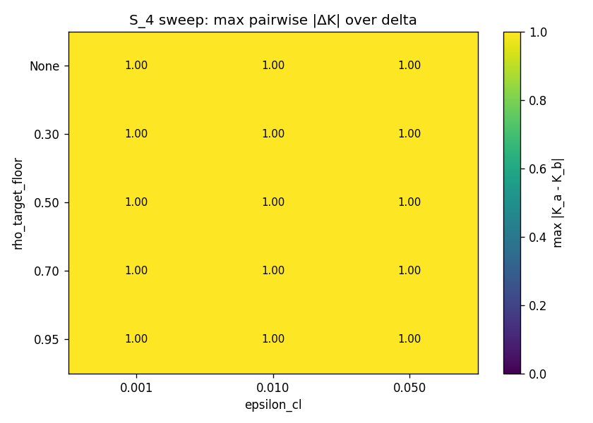

# Sensitivity sweep S_4 — отчёт
**Сценарий:** S_4 water partial degradation, u=[0, 0.30, 0], x0=[0.3, 0.3, 0.3], T=24, Δt=1.0, θ_node=0.75.
**σ (arithmetic Δx, x-space):** energy=0.4155, water=0.1090, transport=0.0000.
**N_runs (стохастика):** 1000. Фиксированный seed list 0..999.
**Базовая матрица A:** A_WIOD_v4 DEU, ρ(A)=0.0220, max|a_ij|=0.0362.

## 1. Методология sweep
Декартово произведение 45 = 5 × 3 × 3:
- `rho_target_floor` ∈ {None, 0.30, 0.50, 0.70, 0.95} — None=без доп. масштабирования; число φ = если ρ(A) < φ, то A ← A·(φ/ρ(A)) (ceiling-or-floor).
- `epsilon_cl` ∈ {0.001, 0.01, 0.05} (0.05 pre-registered §0.4).
- `delta` ∈ {0.05, 0.10, 0.20} (0.10 pre-registered §0.4).

На каждой конфигурации запускаются 5 операторов (K_Leontief, K_cl, K_DR, K_q_deg, K_q_abs). Вычисляются 10 попарных |K_a − K_b|, margin (K ∈ (0.05, 0.95) для ≥1 оператора), working region (все K ∈ (0,1) AND max|ΔK| ≥ 0.1).

## 2. Сводная статистика
- Всего конфигов: **45**
- Working region (все K∈(0,1) ∧ max|ΔK|≥0.1): **0/45**
- Маргинальные (есть K∈(0.05, 0.95)): **0/45**

## 3. Топ-10 конфигураций по max попарному |ΔK|
| rank | rho_floor | eps_cl | delta | max\|ΔK\| | best pair | rho_eff | max\|a\| |
|---:|:---:|:---:|:---:|---:|:---|---:|---:|
| 1 | None | 0.001 | 0.05 | 1.000 | K_leontief_vs_K_q_deg (1.000) | 0.022 | 0.036 |
| 2 | None | 0.001 | 0.10 | 1.000 | K_leontief_vs_K_q_deg (1.000) | 0.022 | 0.036 |
| 3 | None | 0.010 | 0.05 | 1.000 | K_leontief_vs_K_q_deg (1.000) | 0.022 | 0.036 |
| 4 | None | 0.010 | 0.10 | 1.000 | K_leontief_vs_K_q_deg (1.000) | 0.022 | 0.036 |
| 5 | None | 0.050 | 0.05 | 1.000 | K_leontief_vs_K_q_deg (1.000) | 0.022 | 0.036 |
| 6 | None | 0.050 | 0.10 | 1.000 | K_leontief_vs_K_q_deg (1.000) | 0.022 | 0.036 |
| 7 | 0.30 | 0.001 | 0.05 | 1.000 | K_leontief_vs_K_cl (1.000) | 0.300 | 0.495 |
| 8 | 0.30 | 0.001 | 0.10 | 1.000 | K_leontief_vs_K_cl (1.000) | 0.300 | 0.495 |
| 9 | 0.30 | 0.001 | 0.20 | 1.000 | K_leontief_vs_K_cl (1.000) | 0.300 | 0.495 |
| 10 | 0.30 | 0.010 | 0.05 | 1.000 | K_leontief_vs_K_cl (1.000) | 0.300 | 0.495 |

## 4. Working region
🔴 **Пусто.** Ни одна из 45 конфигураций не даёт одновременно (а) все K ∈ (0,1) и (б) max попарное |ΔK| ≥ 0.1. Методология в текущей калибровке не имеет режима, где 5 операторов одновременно различимы.

## 5. Heatmap (rho_floor × epsilon_cl)
Цвет ячейки = max попарное |ΔK|, максимум по всем значениям δ для данной пары.

## 6. Интерпретация
_автоматическая сводка; итоговое суждение за автором_:

- Максимум max|ΔK| по всей сетке: **1.000** при rho_floor=None, eps_cl=0.001, δ=0.05.
- Достижимая максимальная различимость |ΔK|=1.000 ≥ 0.25 — ConfirmationRate-potential присутствует.
- См. `sweep_s4_raw.json` для полных K/D/x_final по каждому оператору и `sweep_s4_summary.csv` для выгрузки в Excel.

## 7. Решения автора — оставлены открытыми
Sweep НЕ применяет найденных параметров к основной калибровке. Pre-registered параметры (θ_node=0.75, ε_cl=0.05, δ=0.10) сохранены. Решение о следующем шаге — за автором.
